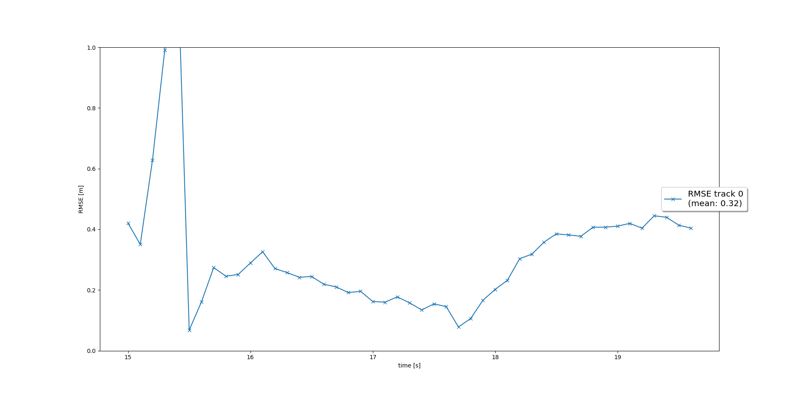
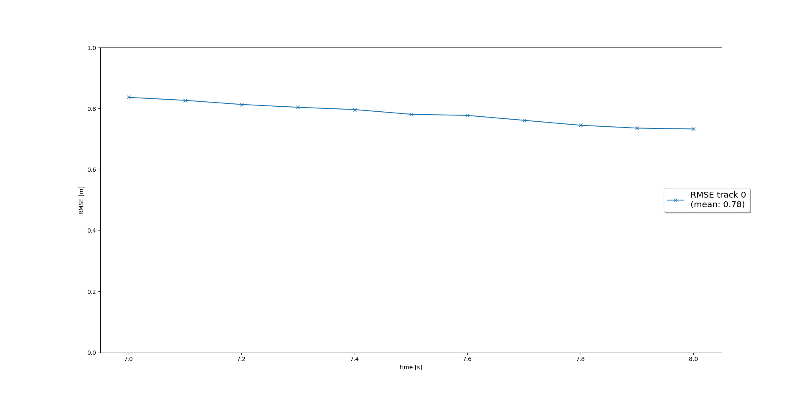
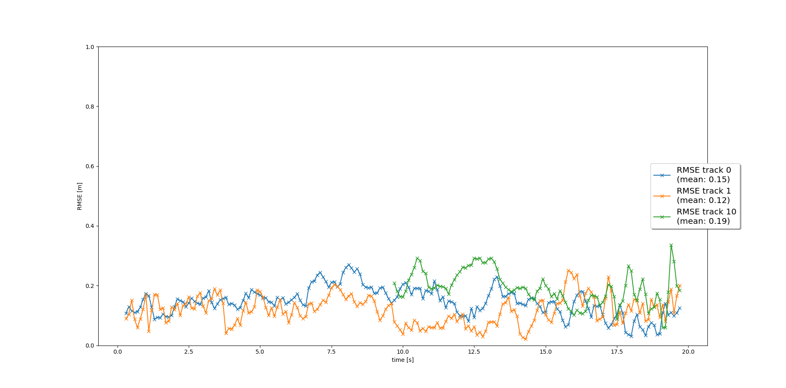
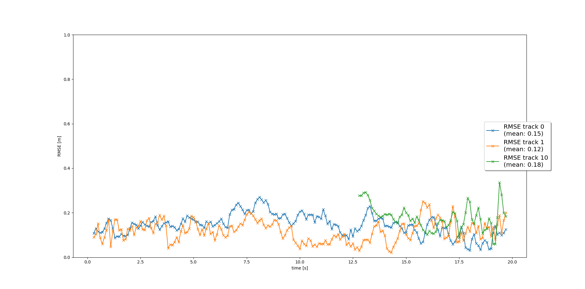

# Writeup: Track 3D-Objects Over Time

### 1. Project recap

Sensor Fusion and Object Tracking project is meant to get hands-on experience in sensor fusion, in this case LIDAR and Camera sensors. This project implements EKF (Extended Kalman Filter) algorithm which take into account Camera non-linear measurement model.
In the first step EKF to track a single real-world target with lidar measurement input over time was implemented. RMSE from the first step are presented in the chart

In the second step track management to initialize and delete tracks, set a track state and a track score was implemented. RMSE from the second step are presented in the chart

In the third step single nearest neighbor data association to associate measurements to tracks was implemented. RMSE from the third step are presented in the chart

In the last forth step nonlinear camera measurement model is implemented. Finally, the sensor fusion module for camera-lidar fusion is completed. Results from this step can be sean in the movie showcase

At last video is build that present sensor fusion module in action

### 2. Benefits in camera-lidar fusion compared to lidar-only tracking (in theory and in concrete results)? 

It is not safe to relay on a single sensor alone because every sensor has its strengths and weaknesses and may fail at some point, and building self-driving car is about safety.

For example camera and LIDAR sensors can have different view angles and are behaving differently in different weather conditions
so combining the measurements from both sensors improve the vehicle perception capabilities. In this concrete project this can be sean
in the results before camera sensor is involved in tracking and after because incorrect results are reduced.

### 3. Fusion system challenges in real-life scenarios

Sensor fusion system in real-life applications will face difficulties because of the unpredicted conditions, implemented algorithms like for example
nearest neighbor data association algorithm. Sensor fusion system will also face issues due to parameter adjustments because many parameters are selected by experience 
and their values may need to be adjusted to increase sensor fusion system.

### 4. Ways to improve your tracking results in the future

Experiment with fusion system parameters in order to improve parameter results. Include measurements from additional sensors (additional cameras for example) in the fusion system calculations 

