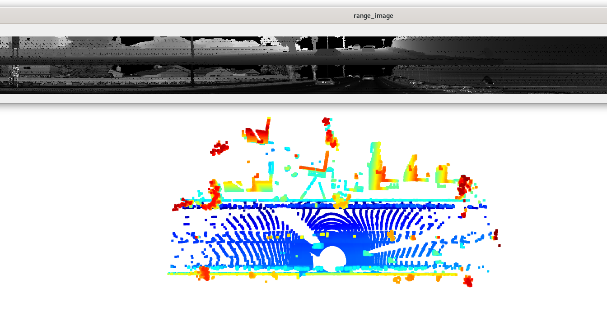
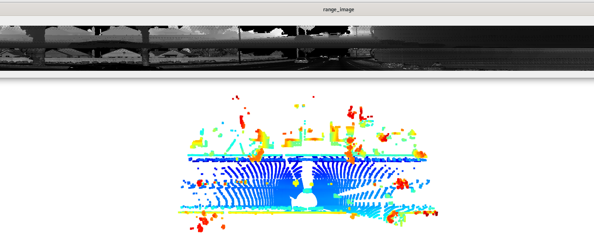
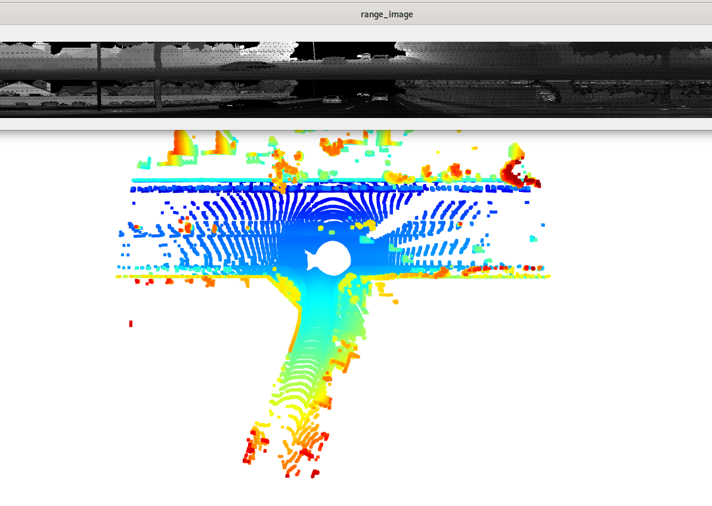
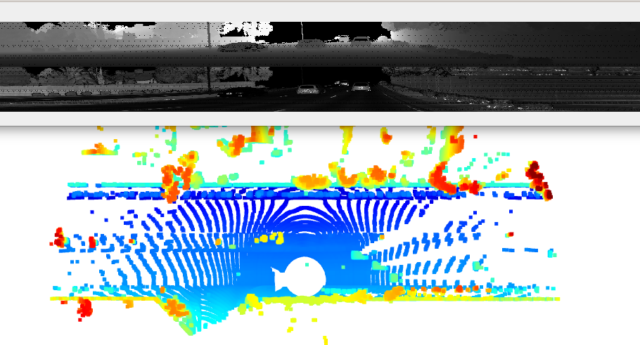
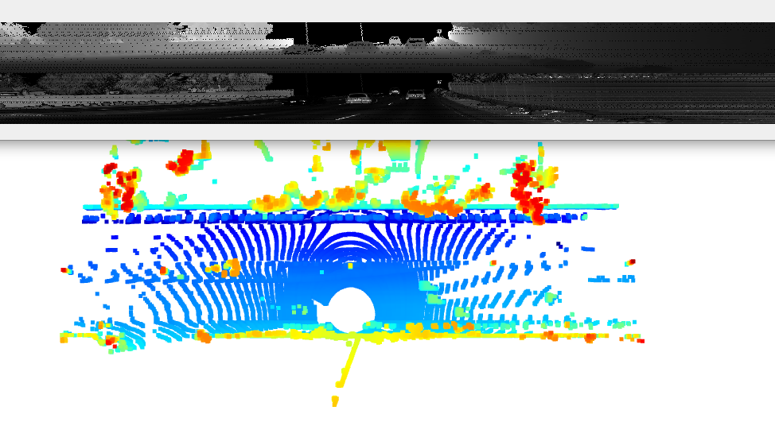
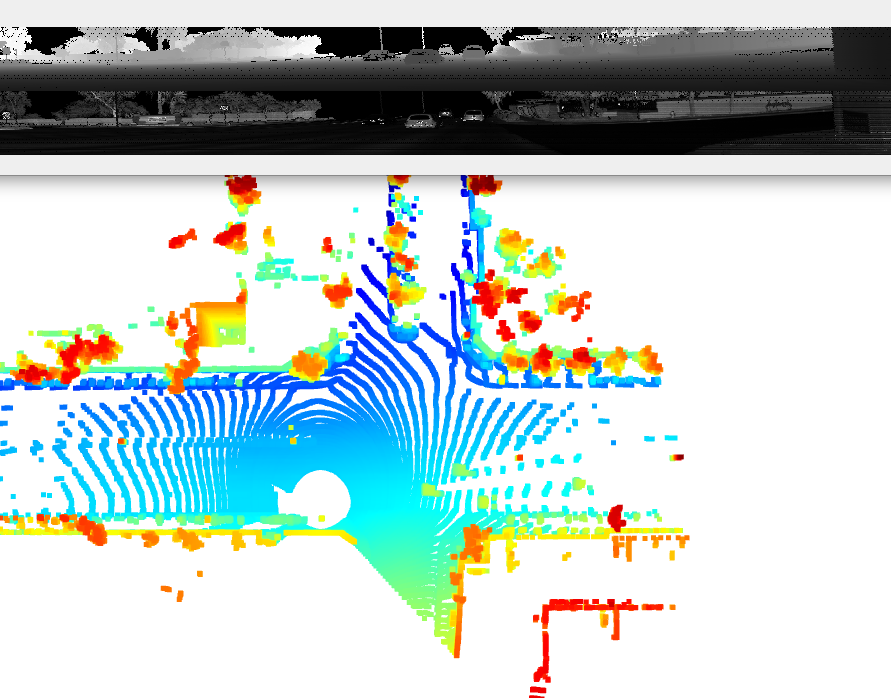
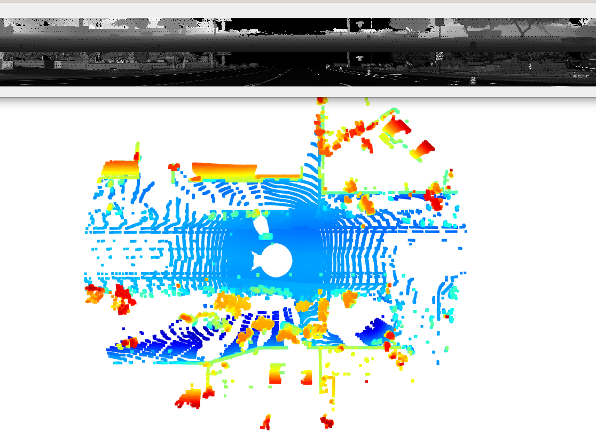
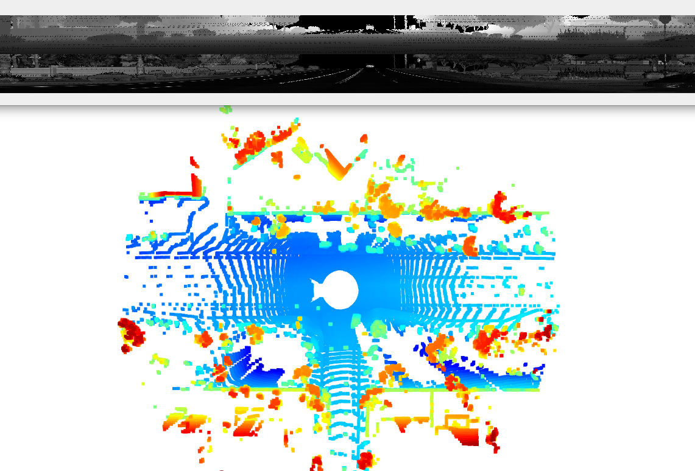
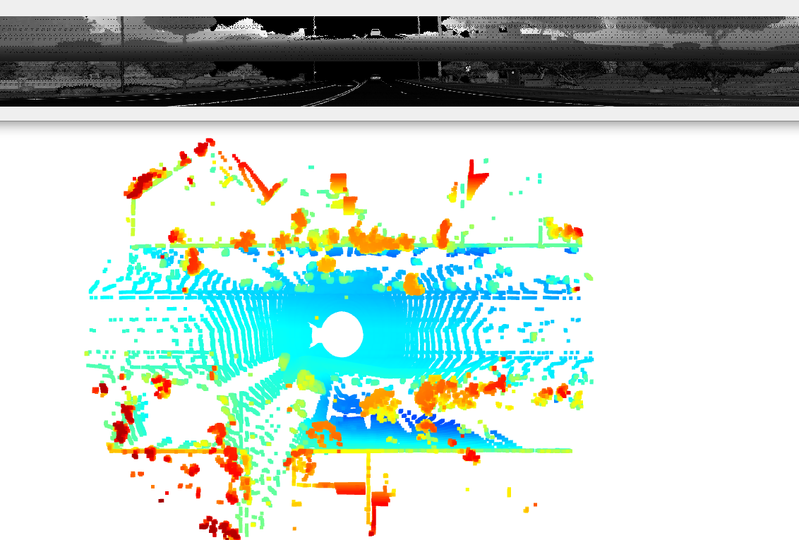
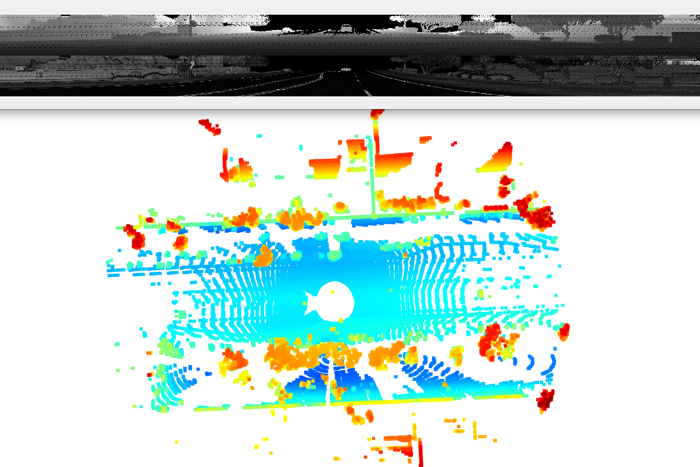

# Writeup: Track 3D-Objects Over Time

3D Object Detection mid-term project suppose to demonstrate capabilities to extract lidar range image from Waymo Open Dataset input TensorFlow file, display point cloud image, convert to BEV image and by using  pre-trained Complex YOLO Convolutional Neural Network detect objects and at the end asses detection results.

### Vehicles with varying degrees of visibility in the point-cloud

In the following images fragments of point cloud image and range image are presented next to each other so vehicles visible in the point cloud images can be also vied in the range image.

### Performance metrics results

